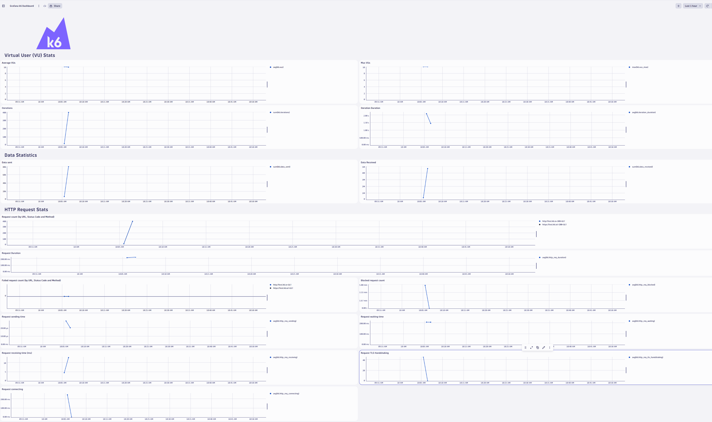
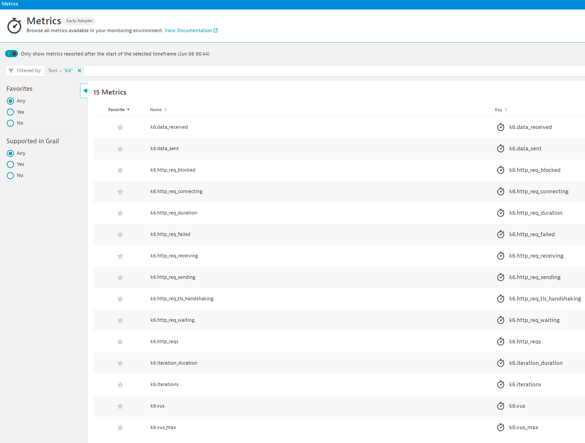

# Dynatrace + k6 Hands on Demo

This demo will run a k6 script and use the dynatrace output plugin to stream metrics to Dynatrace.

## Compatibility

| Deployment         | Tutorial Compatible |
|--------------------|---------------------|
| Dynatrace Managed  | ✔️                 |
| Dynatrace SaaS     | ✔️                 |
| Dynatrace Platform | ✔️                 |

## Gather Details: Tenant ID

You will need access to a Dynatrace tenant. If you do not have access, [sign up for a free 15 day trial](https://dt-url.net/trial).

Make a note of your Dynatrace tenant ID. It is the first bit of your URL (eg. `abc12345` in the following examples):

```
https://abc12345.live.dynatrace.com
https://zeb00185.apps.dynatrace.com
```

Reformat the URL like this: `https://TENANT_ID.live.dynatrace.com` eg. `https://abc12345.live.dynatrace.com`

## Gather Details: Create API Token

k6 requires an API token to stream metrics to Dynatrace.

Create an API token with `metrics.ingest` permissions.

## Start Demo

1. Fork this repository into your Github account
1. Click the green "Code" button
1. Switch to the `Codespaces` tab
1. Click the three dots `...`
1. Choose `New with options...`
1. Enter your Tenant URL and API token (these will be encrypted and stored as secrets)
1. Wait for the demo to start

## Import Dynatrace Dashboad (Dynatrace platform only)

1. Save the [k6 dashboard](dashboards/Grafana%20k6%20Dashboard.json) to your local machine.
1. In Dynatrace, navigate to `Dashboards` and click `Upload`
1. Upload the dashboard JSON file

## View statistics



The demo environment will start k6 automatically so metrics should soon (with a minute or two) begin streaming into Dynatrace and the dashboard should populate.

To see the raw list of metrics, head to the `Metrics` screen (Ctrl + k and search for `metrics`) then type `k6`.



## Cleanup

The demo environment is disposable. Head to [GitHub Codespaces](https://github.com/codespaces) and delete the running codespace. This will prevent any unexpected charges.